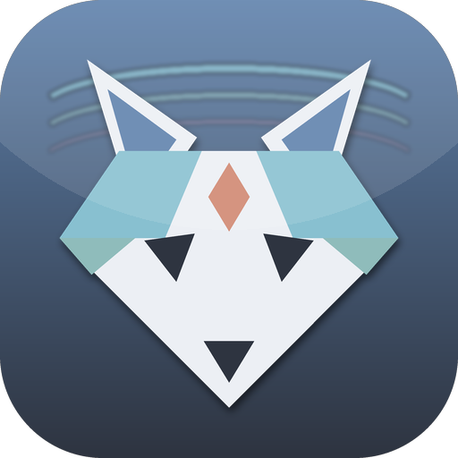
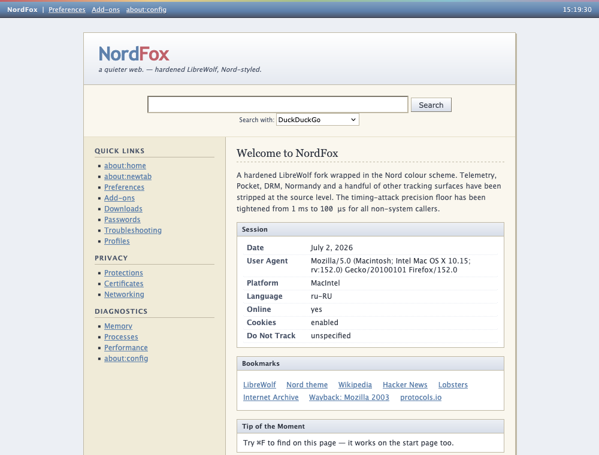

<div align="center">



# NordFox

**A quieter web — hardened Firefox ESR, Nord-styled.**

**New native desktop editions for Windows, Linux, and macOS.** Each edition
builds Firefox ESR for its target operating system with NordFox hardening,
privacy defaults, theme, and branding integrated into the application.

**[Choose your OS on the NordFox website](https://nordfox-sirmir25.pages.dev/#download)** ·
**[View GitHub Releases](https://github.com/sirmir25/NordFox/releases)**

<p>


</p>



</div>

---

## Installation

Open the **[official NordFox download page](https://nordfox-sirmir25.pages.dev/#download)**,
choose your operating system, and download its package. The same files are
published under **[GitHub Releases](https://github.com/sirmir25/NordFox/releases)**.

> [!NOTE]
> The installation files have not been published yet. Windows and Linux
> packaging is ready for release; the refreshed Apple Silicon macOS package is
> still in preparation. The steps below apply as soon as the files appear.

### Windows 10/11 x86_64

#### Installer — recommended

1. Download `NordFox-<version>-windows-x86_64-installer.exe`.
2. Double-click the installer.
3. If Microsoft Defender SmartScreen appears, click **More info**, then
   **Run anyway**. The first release is not code-signed.
4. Complete the setup wizard.
5. Open **NordFox** from the Start menu.

#### Portable version

1. Download `NordFox-<version>-windows-x86_64.zip`.
2. Right-click the archive and choose **Extract All**.
3. Open the extracted folder and run `firefox.exe`. The application is branded
   as NordFox and does not need to be installed.

### Linux x86_64

1. Download `NordFox-<version>-linux-x86_64.tar.bz2` and its matching
   `.sha256` file.
2. Open a terminal in your Downloads directory and verify the archive:

   ```sh
   cd ~/Downloads
   sha256sum -c NordFox-*-linux-x86_64.tar.bz2.sha256
   ```

3. Extract NordFox into your local applications directory:

   ```sh
   mkdir -p ~/.local/opt/nordfox
   tar -xjf NordFox-*-linux-x86_64.tar.bz2 \
     -C ~/.local/opt/nordfox --strip-components=1
   ```

4. Launch the browser:

   ```sh
   ~/.local/opt/nordfox/firefox
   ```

The portable package stays separate from the Firefox package installed by your
Linux distribution. To remove NordFox, delete `~/.local/opt/nordfox`.

### macOS Apple Silicon

The native macOS build targets M-series Macs. Intel Macs are not supported.

1. Download `NordFox-<version>-arm64.dmg`.
2. Double-click the DMG and drag `NordFox.app` into **Applications**.
3. Eject the NordFox disk image.
4. Open **Applications**, right-click `NordFox.app`, and choose **Open**.
5. Confirm **Open** once more if Gatekeeper warns that the app is not
   notarized. Later launches work normally.

If macOS does not show the confirmation button, first try to launch NordFox,
then open **System Settings → Privacy & Security** and choose **Open Anyway**.

### Updating NordFox

Automatic updates are disabled. Download the newer package from the website or
GitHub Releases and replace the existing installation. Your browser profile is
stored separately and is not removed when the application is replaced.

## What this is

NordFox is a source build: every artifact starts from Mozilla's Firefox ESR
tarball, verified against Mozilla's published SHA-256 manifest before anything
is compiled. NordFox then applies its source hardening, privacy defaults,
cross-platform branding, and local start pages before Mozilla's native build
and packaging tools run.

The result is an app bundle you built, from sources you can check, with the
telemetry surfaces removed at the source level rather than switched off by a
preference that a future update can flip back.

## What it changes

### Removed from the source

| | |
|---|---|
| **Normandy** | Shield studies — dropped from the toolkit build |
| **Pocket** | Dropped from the browser build |
| **EME / DRM** | `--disable-eme` |
| **Crash reporter** | `--disable-crashreporter` |
| **Mozilla updater** | `--disable-updater` |

These are compiled out, not disabled by a pref.

### Hardened

- **Timing precision.** `performance.now()` is forced to a 100 µs floor for
  every non-system caller, not only cross-origin-isolated ones. The 1 ms
  default falls to averaging attacks; this does not.
- **Build flags.** `--enable-hardening`, `-fstack-protector-all`,
  `_FORTIFY_SOURCE=2`, sandbox enabled.
- **Preferences.** ~340 defaults in `security/user.js`, based on
  [arkenfox/user.js](https://github.com/arkenfox/user.js), are compiled into
  the app's AutoConfig payload.

### Build compatibility

- Auto Rust LTO is gated on `MOZ_LTO`, so `--disable-lto` actually disables LTO
  end to end across all native targets.
- The legacy macOS pipeline also detects Apple's newer `ld-1267` linker.

### Styled

A Nord-palette `userChrome.css` / `userContent.css`, plus a retro start page
and new-tab page written in TypeScript — local, no network, no telemetry.

## Build

### Linux x86_64

```sh
python3 -m pip install pillow
python3 build_native.py linux all
```

Use a supported 64-bit Linux distribution with Python 3.9+, Node.js, Git, at
least 8 GB of memory, and at least 30 GB of free disk space. Mozilla's
`mach bootstrap` installs the remaining compiler dependencies.

### Windows x86_64

Install [MozillaBuild](https://ftp.mozilla.org/pub/mozilla/libraries/win32/MozillaBuildSetup-Latest.exe),
open PowerShell with `C:\mozilla-build\bin` on `PATH`, then run:

```powershell
python -m pip install pillow
python build_native.py windows all
```

The result includes both a native full installer and a portable ZIP. Mozilla's
own NSIS packaging flow creates the installer, including the Microsoft runtime
redistributable.

<details>
<summary>Run one build stage at a time</summary>

```sh
python3 build_native.py linux fetch
python3 build_native.py linux prepare
python3 build_native.py linux build
python3 build_native.py linux package
```

</details>

### Verifying what you build

The Firefox tarball is checked against Mozilla's published `SHA256SUMS` before
extraction.

Every required NordFox source edit is fail-closed: a patch whose context no
longer matches aborts the build instead of silently shipping a less-hardened
browser. Integrations already removed by newer Firefox versions are reported
separately as safe skips.

## Install the theme and prefs only

To apply the theme and `user.js` to an existing Firefox or LibreWolf profile
without building a browser:

```sh
./install.sh [/path/to/profile]
```

With no argument it auto-detects a profile. Anything it would overwrite is
backed up to `.bak` on the first run — and only the first, so re-running never
destroys your original.

## Layout

| Path | |
|---|---|
| `build_native.py` | verified Windows/Linux fetch, patch, build, and package pipeline |
| `mozconfigs/` | native hardened Linux and Windows build configurations |
| `.github/workflows/native-release.yml` | builds both native packages and publishes a release |
| `build.sh` | legacy macOS arm64 build pipeline |
| `install.sh` | install theme + `user.js` into a profile |
| `mozconfig` | hardened build configuration |
| `patches/apply.py` | source patches, applied by string substitution |
| `security/user.js` | privacy and security preferences |
| `theme/src/` | start page and new-tab page (TypeScript) |
| `theme/build.sh` | compile `theme/src/` → `theme/build/` |
| `branding/` | icon, brand strings, autoconfig |
| `site/` | project landing page |

Patches are applied by matching source text, not line numbers, so they survive
line drift between ESR point releases. Interdependent edits are applied as an
atomic group — nothing is written unless every context resolves.

> [!TIP]
> `patches/*.patch` are the original unified diffs, kept for reference only.
> The build runs `patches/apply.py`; it does not read those files.

## Caveats

- Windows and Linux packages are x86_64 only.
- The refreshed macOS package is not published yet and will target Apple
  Silicon.
- The Windows installer is unsigned; SmartScreen can warn on first launch.
- Automatic updates remain disabled. Install a newer NordFox release manually.
- The legacy macOS script still targets the earlier ESR 128 arm64 build tree.

## License

MIT for the code in this repository. The patch files quote Firefox source,
which is MPL-2.0; `security/user.js` derives from arkenfox/user.js (MIT).

<div align="center">
<sub>LibreWolf-inspired privacy defaults · themed with <a href="https://www.nordtheme.com/">Nord</a></sub>
</div>
